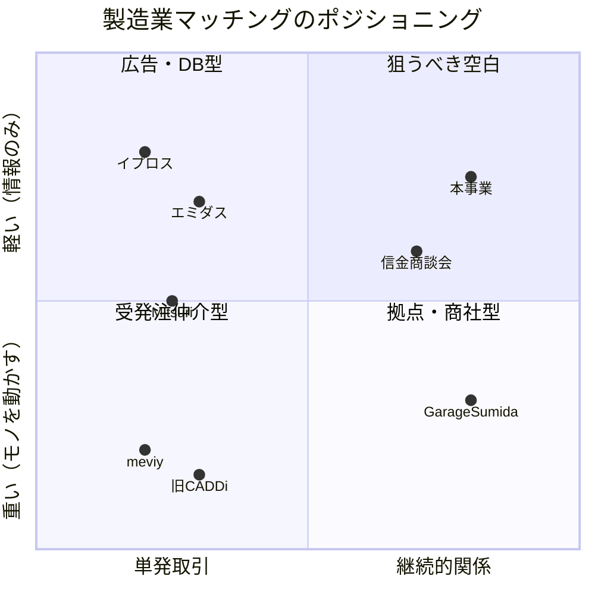

# 町工場×発注企業をつなぐ「コミュニティ型ものづくりマッチング」事業プラン

> 作成日: 2026-07-18
> 前提調査: [調査①NCネットワーク](./research-01-nc-network.md) / [調査②競合・市場ギャップ](./research-02-competitors.md)

---

## 0. エグゼクティブサマリー

- **やること**: 専門性の高い技術を持つ町工場と発注企業（メーカー・スタートアップ・設計会社）を、単発の「見積りマッチング」ではなく**継続的な信頼関係＝コミュニティ**で結ぶプラットフォームを作る。
- **既存最大手のNCネットワーク（エミダス、登録2.2万社超）は「検索データベース＋月額掲載料」モデル**であり、①取引実績にもとづく信頼の可視化、②町工場同士の横連携（共同受注）、③人材・技術継承、というコミュニティ的価値はカバーしていない。ここが参入余地。
- **CADDiの受発注仲介撤退（2024年）とDMM.make AKIBAの閉鎖（2024年）が示す2つの地雷**——「モノを自社で動かすと重すぎる」「物理拠点だけでは稼げない」——を避け、**モノを動かさず、情報・信頼・関係性の流通に特化した軽量モデル**で設計する。
- 立ち上げは「全国×全業種」ではなく、**1地域×1〜2工程領域（例: 精密切削・板金）で50社の濃いコミュニティ**から始め、成功パターンを横展開する。

---

## 1. 前提: NCネットワーク（エミダス）の確認結果

| 観点 | 内容 |
|---|---|
| 中核サービス | エミダス工場検索（約200種の加工技術カテゴリ・設備型番で検索できる製造業特化ポータル） |
| 規模 | 会員22,000社超（国内外DB全体で約5万社規模との情報も） |
| 収益モデル | 月額固定の掲載料（無料〜PRO: 初期33万円＋月額5.5万円）。**成約手数料なし・取引は直接** |
| 周辺事業 | 加工の生産委託窓口(分社化)、HP/動画制作、情報誌エミダスマガジン、海外商談会(アジア最大級) |
| 強み | 最古参の知名度、ニッチ技術の検索性、発注側購買担当の来訪、海外一気通貫 |
| 弱み | 有料プランの費用対効果の見極めが必要、受け身掲載では低単価案件に埋もれる、関係構築・実績可視化の仕組みは薄い |

**解釈**: エミダスは「町工場のYellow Pages（検索して見つける場所)」として完成度が高い。一方で「見つけた後の信頼構築」「工場同士の連携」「継続取引の資産化」は構造的に空いている。真正面から検索DBで戦うのではなく、**エミダス等で"見つかった後"の領域＝関係性のレイヤー**を取りにいく。

## 2. 競合マップと自分たちのポジション

- 横軸(関係の継続性)×縦軸(オペレーションの軽さ)で見ると、**「継続的関係×軽量運営」の右上象限が空白**。
- 調査で特定した市場ギャップ5点（詳細は調査②）:
  1. 取引実績にもとづく**信頼スコアの可視化**が存在しない
  2. 町工場同士の**横連携・共同受注**を支えるデジタル基盤がない
  3. 「モノを動かさない×成約時のみ薄く課金」の**中間ポジション**が手薄
  4. 全国の町工場集積地を横串でつなぐ**デジタル×リアルのハイブリッド**が未成熟
  5. 仕事のマッチングと**人（後継者・採用・技術継承）**のマッチングが分断

## 3. 事業コンセプト

**「発注先を探す場所」ではなく「ものづくりの信頼が蓄積される場所」**

- 名称仮案: 「TAKUMI BASE」「町工場ギルド」など（要ブランディング検討)
- 一言で: *町工場の技術・実績・人柄が可視化され、発注側とも工場同士とも継続的につながれる会員制コミュニティ*
- 3つの価値:
  1. **見つかる** — 技術タグ・設備・得意領域による検索性（エミダス同等の基本機能）
  2. **信頼できる** — 取引実績・品質/納期評価・他工場からの推薦が蓄積される「信頼グラフ」
  3. **つながり続ける** — 技術相談、共同受注アライアンス、勉強会・工場見学会、後継者/採用支援

### CADDi/DMMの教訓を踏まえた設計原則

| 原則 | 内容 |
|---|---|
| モノを動かさない | 品質保証・納期責任・物流は負わない。取引は当事者間の直接契約。プラットフォームは紹介・情報・決済補助まで |
| 物理拠点を持たない | リアルイベントは既存拠点(MOBIO、信金、自治体施設、会員工場)を間借り。固定費を持たない |
| 最初から狭く濃く | 全国×全業種で薄く始めない。1地域1領域で「顔が見える」密度を作ってから横展開 |
| 収益は複線化 | 単一収益源(掲載料のみ/手数料のみ)に依存しない。会費＋成約フィー＋周辺サービス |

## 4. ターゲット

### 受注側（町工場）
- 従業員5〜50名、特定工程(精密切削、微細加工、板金、表面処理、金型等)に強みを持つ
- 営業専任者がいない/1名。既存顧客依存度が高く新規開拓したいが方法がない
- 経営者は40〜60代。後継者・採用にも課題感
- **ペルソナ例**: 大田区の精密切削加工業(社員12名)。大手1社への依存度60%を下げたい。技術に自信はあるがWebでの発信が苦手

### 発注側
1. **スタートアップ/新規事業部門**: 試作〜小ロットの相談相手が欲しい。図面が固まる前の「相談」ニーズが強い(Garage Sumidaが証明した領域)
2. **中堅メーカーの購買/設計**: 既存サプライヤーの高齢化・廃業で代替先探しが急務
3. **設計事務所・開発受託会社**: 案件ごとに最適な加工パートナーが必要

## 5. サービス設計（機能）

### Phase 1: MVP（コミュニティ+プロフィール）
- **工場プロフィール**: 技術タグ、設備、加工事例(写真/動画)、対応ロット、得意材質。※動画・事例ベースで「人柄と現場」が見えることを重視(エミダスとの差別化)
- **案件相談ボード**: 発注側が図面確定前の「こういうことできる工場いますか?」を投稿→工場が手を挙げる。RFQ(正式見積依頼)より手前の相談から入るのがポイント
- **会員限定Slack/Discord的コミュニティ**: 技術相談チャンネル、工程別チャンネル、雑談
- **月1回のリアル/オンライン交流会**: 工場見学会、発注側との名刺交換会、技術勉強会

### Phase 2: 信頼の資産化
- **取引実績バッジ**: 成約報告にもとづく「この工場は本コミュニティ経由でN件の取引実績」表示
- **相互評価**: 品質・納期・コミュニケーションの3軸。発注側→工場だけでなく工場→発注側も評価(下請けいじめ的発注者の排除=工場側が安心できる場)
- **工場間推薦**: 「うちでは出来ないがあの工場なら出来る」の紹介をデータ化。紹介元にもインセンティブ

### Phase 3: 横連携と人材
- **共同受注アライアンス**: 複数工場でユニットを組み、装置一式・ユニット品などの大型案件を受ける機能(幹事工場+参加工場のテンプレート契約を提供)
- **人材・承継マッチング**: 若手技術者の採用支援、技術継承インターン、事業承継/M&A相談窓口(専門家と提携)

## 6. 収益モデル

| 収益源 | 対象 | 価格イメージ | 位置づけ |
|---|---|---|---|
| コミュニティ会費 | 町工場 | 月5,000〜15,000円 | 基礎収益。エミダスPRO(月5.5万)より大幅に安く、無料DBより濃い価値 |
| 発注側会員費 | 発注企業 | 月30,000〜50,000円(検索・相談し放題) | 主力収益。J-GoodTech無料/エミダスとの差別化は「相談の質とスピード」 |
| 成約サポートフィー | 双方任意 | 成約額の3〜5%(上限あり)、または成約報告で実績バッジ付与のみ(無料) | Mitsuriの10%より軽く。実績可視化と引き換えに自己申告を促す設計 |
| イベント/スポンサー | 工具・材料・機械商社、金融機関 | 協賛10〜50万円/回 | 町工場という顧客層にリーチしたい企業は多い |
| 周辺サービス | 工場 | 事例動画制作、Webプロフィール代行 等 | NCネットワークで実証済みの周辺収益 |

**損益の目安（Phase 1終了時点の目標)**: 工場会員100社×月1万円＋発注会員20社×月4万円 = 月商約180万円。運営2〜3名の人件費をほぼ賄えるライン。

## 7. 差別化まとめ（vs 主要競合）

| | エミダス | CADDi(現) | Mitsuri | J-GoodTech | 本事業 |
|---|---|---|---|---|---|
| モデル | 検索DB+掲載料 | 図面データSaaS | 成約手数料10% | 公的・無料 | コミュニティ会費+軽い成約フィー |
| 関係性 | 単発検索 | 発注企業内のDX | 単発見積 | 案件単位 | **継続コミュニティ** |
| 工場同士の横連携 | なし | なし | なし | 弱い | **共同受注・相互推薦** |
| 信頼の可視化 | 掲載情報のみ | — | 一部 | 公的審査 | **取引実績・相互評価** |
| 人材・承継 | なし | なし | なし | なし | **Phase 3で統合** |

## 8. ロードマップ

### Phase 0: 検証（〜3ヶ月）
- 対象地域・工程領域の決定（候補: 大田区/東大阪/燕三条 × 精密切削・板金）
- 町工場15社・発注側5社への課題ヒアリング（「月1万円払う価値があるか」を直接確認）
- 手動マッチング(コンシェルジュ型)を5件試行し、成約プロセスと課金受容性を検証
- **Go/No-Go基準**: ヒアリングで工場10社以上が有料会員意向、手動マッチング2件以上成約

### Phase 1: MVP（4〜9ヶ月）
- Webプロフィール+案件相談ボード+コミュニティ(既存ツール流用可)を最小構成で構築
- 創業メンバー(またはアンバサダー工場)の人脈で初期50社を招待制で獲得 ※招待制にすることで質と密度を担保
- 月1イベント運営。KPI: 工場50社/発注10社/相談投稿 月10件/成約 月2件

### Phase 2: 信頼機能+収益化本格化（10〜18ヶ月）
- 実績バッジ・相互評価・紹介機能をリリース。有料プラン本格課金開始
- 地域金融機関(信金)・自治体・商工会議所と提携し送客チャネル化（信金は「取引先支援」ニーズがあり無償で協力を得やすい——調査②参照)
- KPI: 工場150社/発注30社/月商150万円

### Phase 3: 横展開（19ヶ月〜）
- 第2地域・第2工程領域へ展開。共同受注・人材/承継機能をリリース
- エミダス/イプロス等とは補完関係として、掲載企業の誘導提携も検討

## 9. リスクと対策

| リスク | 対策 |
|---|---|
| 鶏卵問題（発注側が来ないと工場が定着しない） | Phase 0-1は運営がコンシェルジュとして案件を持ち込む。スタートアップ支援機関・設計事務所と提携し案件供給を先に確保 |
| 直接取引化（成約フィーの中抜け） | フィーを軽く(3〜5%or無料+実績バッジ)し、報告するメリット(信頼スコア向上)>隠すメリットの構造にする |
| エミダスなど既存大手の機能追随 | 検索DBは彼らの土俵なので戦わない。招待制の密度・地域リアル接点・工場間の信頼グラフは後発が模倣しにくい |
| コミュニティ運営の属人化・疲弊 | アンバサダー工場(地域の顔役)に運営を分担してもらい報酬/フィーバックを設計 |
| 品質トラブル時の巻き込まれ | 利用規約で当事者間直接契約を明記、プラットフォームは紹介責任を負わない構造(エミダスと同様)。任意で取引保険の紹介 |

## 10. 直近のネクストアクション

1. ターゲット地域×工程領域を1つ決める（推奨: 自身の人脈が最も濃い地域から）
2. 町工場5社への非公式ヒアリング（課題の言語化、支払意思の確認）
3. コンセプト1枚ペライチ（LP）を作成し、ヒアリング時の反応測定に使う
4. Phase 0の手動マッチング候補となる発注案件を2〜3件確保（知人のスタートアップ/設計会社経由）
5. 信金・商工会議所の中小企業支援窓口に1件アポイント（提携可能性の温度感確認）
