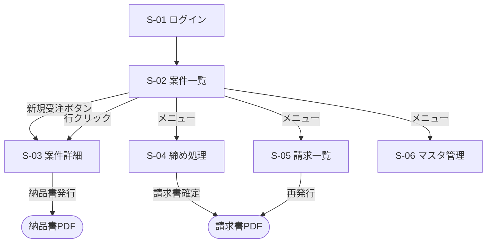

# 販売管理システム 画面設計書

- 版数: 1.0(初版)
- 前提: 実装形態は Web アプリ推奨案([01_要件定義書.md](01_要件定義書.md) 6章)に基づく。Excel + VBA を選択した場合もシート構成として読み替え可能

## 1. 画面一覧

| ID | 画面名 | 概要 | 対応機能 |
|----|--------|------|---------|
| S-01 | ログイン | ユーザーID・パスワードでログイン | F-09 |
| S-02 | 案件一覧 | 全案件の一覧・検索・CSV出力。システムのホーム画面 | F-05, F-08 |
| S-03 | 案件詳細(受注・発注) | 受注情報と発注情報を左右に並べたカード形式。Excelイメージを踏襲 | F-01, F-02, F-03, F-07 |
| S-04 | 締め処理(請求書発行) | 客先を選ぶと締め日から請求期間を自動算出(日付は手修正可)。期間内の納品済み明細を確認して請求書を確定・PDF発行 | F-04 |
| S-05 | 請求一覧 | 発行済み請求書の一覧・再発行・取消 | F-04 |
| S-06 | マスタ管理 | 客先・仕入先・自社情報の登録・編集 | F-06 |

## 2. 画面遷移図



## 3. Excelイメージのボタンと本システムの対応

| Excelイメージのボタン | 本システムでの対応 |
|----------------------|------------------|
| 月末処理 | S-04 締め処理画面(客先ごとの締め日に対応するため名称を一般化) |
| 納品書発行 | S-03 案件詳細の「納品書発行」ボタン |
| 請求書発行 | S-04 で確定時にPDF発行(個別再発行は S-05) |
| 図面情報 | S-03 案件詳細の添付ファイル欄(種別: 図面) |
| 議事録 | S-03 案件詳細の添付ファイル欄(種別: 議事録) |

## 4. 各画面の設計

### 4.1 S-01 ログイン

- 項目: ユーザーID(テキスト)、パスワード(マスク)、ログインボタン
- 認証失敗時はメッセージ表示。成功時は S-02 へ遷移

### 4.2 S-02 案件一覧(ホーム)

```
+------------------------------------------------------------------------------+
| 販売管理システム   [案件一覧] [締め処理] [請求一覧] [マスタ] [ログアウト]      |
+------------------------------------------------------------------------------+
| 検索: 期間[受注日▼][2026-07-01]〜[2026-07-31] 客先[すべて▼] 状態[すべて▼]     |
|       キーワード[          ] [検索] [クリア]        [新規受注] [CSV出力]      |
+------------------------------------------------------------------------------+
| 管理No.|受注日 |客先        |品名    |型式・図番|数量|受注額 |発注額 |粗利  |状態  |
| 10100  |07/10 |ダイゴテック|シャフト|A0010    |  2 |20,000 |16,000 |4,000 |納品済|
| ...                                                                          |
+------------------------------------------------------------------------------+
| 期間合計(2026-07-01〜2026-07-31): 受注額 20,000 / 発注額 16,000 / 粗利 4,000  |
+------------------------------------------------------------------------------+
```

- 一覧列: 管理No.・受注日・客先・品名・型式図番・数量・受注額(小計)・発注額(合計)・粗利・客先納期・納品日・ステータス
- 期間は開始日〜終了日の**日付単位**で自由に指定でき、一覧下部に指定期間の**受注額・発注額・粗利の合計**を表示する(CSV出力にも含める)
- 並び順: 既定は管理No. 降順。列ヘッダクリックでソート
- ステータスは色付きラベル表示(受注済=灰、発注済=青、納品済=緑、請求済=橙、入金済=濃緑、取消=打消し線)
- 客先納期が近い/超過している未納品案件は行を強調表示(納期3日前: 黄、超過: 赤)

### 4.3 S-03 案件詳細(受注・発注カード)

Excelイメージ(受注を左、発注を右に並べる)を踏襲する。

```
+------------------------------------------------------------------------------+
| 案件詳細  管理No. 10100                 状態: [納品済]        [一覧へ戻る]    |
+--------------------------------------+---------------------------------------+
| ■ 受注(客先側)                     | ■ 発注(仕入先側)   [+発注を追加]   |
|  受注日       [2026-07-10]           |  仕入先     [ゆーいち工業▼]           |
|  客先納期     [2026-07-31]           |  発注日     [2026-07-11]              |
|  客先         [ダイゴテック▼]        |  発注納期   [2026-07-29]              |
|  客先担当者   [山田]                 |  品名       [シャフト]  (受注から引継)|
|  客先管理No.  [        ]             |  型式・図番 [A0010]                   |
|  品名         [シャフト]             |  数量       [2] 単位[ヶ]              |
|  型式・図番   [A0010]                |  単価       [8,000]                   |
|  数量         [2] 単位[ヶ]           |  小計       16,000(自動)             |
|  単価         [10,000]               |  備考       [        ]                |
|  小計         20,000(自動)          |                                       |
|  備考         [表面処理注意]         |  粗利: 4,000(受注20,000−発注16,000) |
+--------------------------------------+---------------------------------------+
| ■ 納品   納品日 [2026-07-29]  [納品登録] [納品書発行(PDF)]                  |
| ■ 添付ファイル  種別[図面▼] [ファイル選択] [追加]                            |
|    ・図面: A0010外形図.pdf (07/10 登録)  [DL] [削除]                          |
|    ・議事録: 打合せメモ0708.docx (07/08 登録) [DL] [削除]                     |
+------------------------------------------------------------------------------+
| [保存]  [受注キャンセル]                                                      |
+------------------------------------------------------------------------------+
```

- 新規登録時は管理No. を自動採番して表示する(編集不可)
- 発注ブロックは「+発注を追加」で複数追加できる。品名・型式図番・数量・単位・備考は受注から初期値を引継ぎ、編集可能
- 小計は数量・単価の入力に応じて自動計算(編集不可)
- 発注納期 > 客先納期 の場合は警告メッセージを表示(保存は可能)
- ステータス「請求済」以降は金額・数量欄を読み取り専用にする
- 「納品書発行(PDF)」は納品日入力済みの場合のみ有効

### 4.4 S-04 締め処理(請求書発行)

```
+------------------------------------------------------------------------------+
| 締め処理(請求書作成)                                                        |
| 客先 [ダイゴテック▼]  締め日: 月末                                            |
| 請求期間 [2026-07-01]〜[2026-07-31](締め日から自動計算・手修正可)            |
|                                              [請求対象を抽出]                |
+------------------------------------------------------------------------------+
| □選択 |注文管理No.|受注日|納品日|品名    |型式・図番|数量|単位|単価  |小計  |備考|
| [x]   |10100     |07/10 |07/29 |シャフト|A0010    |  2 |ヶ  |10,000|20,000|    |
+------------------------------------------------------------------------------+
|                                  税抜合計:  20,000                            |
|                                  消費税(10%): 2,000                           |
|                                  ご請求額:  22,000                            |
|                       [請求書を確定して発行(PDF)]                            |
+------------------------------------------------------------------------------+
```

- 客先を選ぶと、客先マスタの締め日から請求期間(前回締め日の翌日〜今回締め日)を自動セットする。例: 月末締め→7/1〜7/31、20日締め→6/21〜7/20。期間の開始日・終了日は日付単位で手修正できるため、任意の期間での集計・請求書発行が可能
- 抽出条件: 指定客先・請求期間内に納品済み、かつ未請求の明細
- 明細のチェックを外すと今回の請求から除外できる(次回以降の締めに持ち越し)
- 「確定して発行」で請求Noを採番し、対象明細を「請求済」に更新、請求書PDFをダウンロード
- 合計欄の表示は Excel イメージ(消費税(10%)・ご請求額)を踏襲

### 4.5 S-05 請求一覧

- 列: 請求No.・請求日・請求期間(開始日〜終了日)・客先・税抜合計・消費税・請求額・状態(発行済/入金済/取消)
- 操作: PDF再発行、入金済にする、請求取消(取消すると対象明細が「納品済」に戻り再請求可能になる)

### 4.6 S-06 マスタ管理

- タブ切替: 客先 / 仕入先 / 自社情報
- 客先: 客先名・敬称(御中/様)・郵便番号・住所・電話・既定担当者・**締め日(月末/1〜31日を選択)**・備考。一覧+行編集
- 仕入先: 仕入先名・郵便番号・住所・電話・備考
- 自社情報: 社名・郵便番号・住所・電話・適格請求書発行事業者登録番号(T+13桁)・振込先(銀行/支店/種別/口座番号/名義)・消費税率(既定10%)

## 5. 共通仕様

- 日付入力はカレンダーピッカー併用。表示形式は `YYYY/MM/DD`(帳票は「7月10日」形式も可)
- 金額はカンマ区切り表示、入力は半角数値
- 必須未入力・型不正はフィールド近傍にエラーメッセージ表示
- 削除・取消・請求確定は確認ダイアログを挟む
- 保存成功時はトースト通知を表示し、直前の画面状態を維持する
